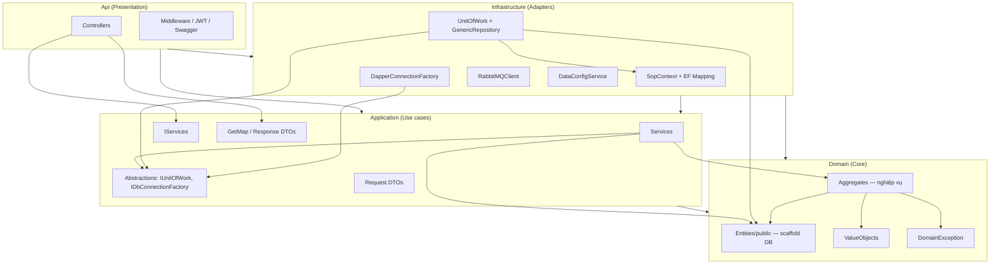
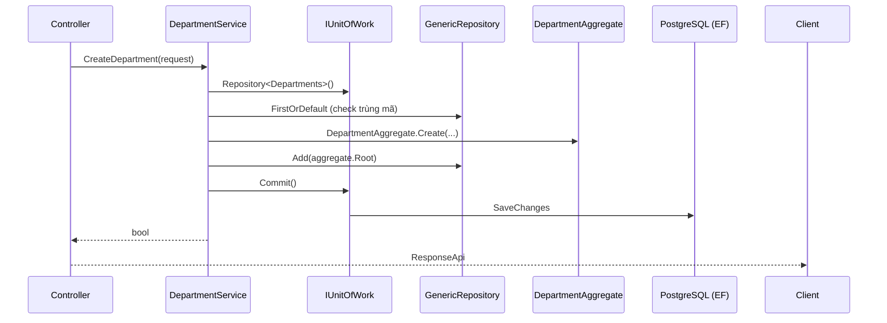
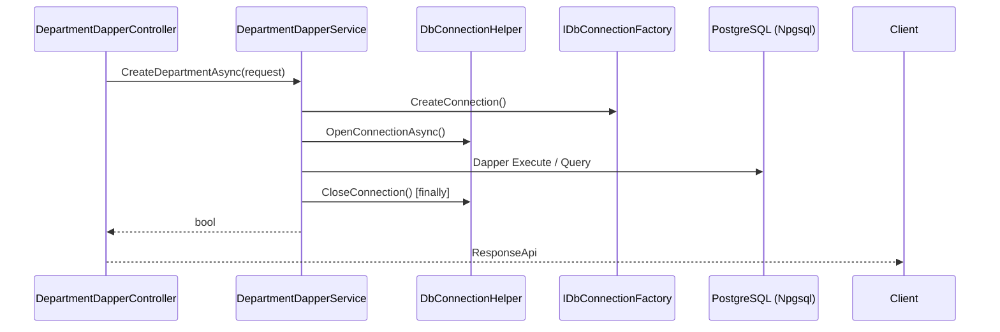
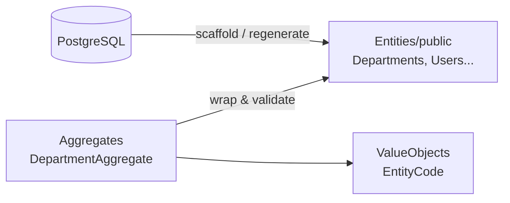
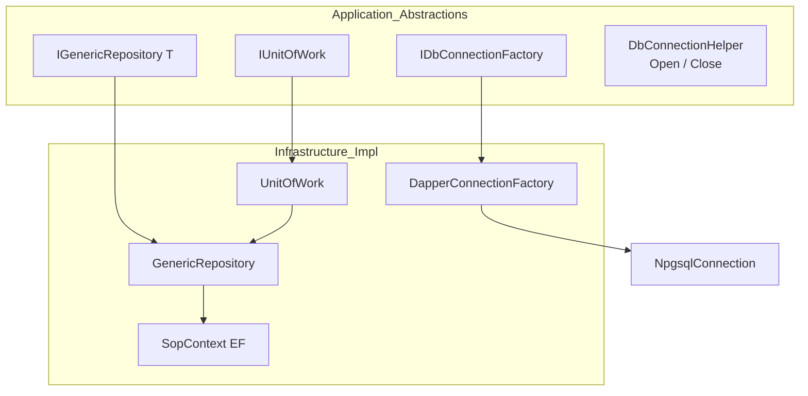
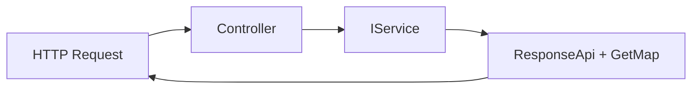
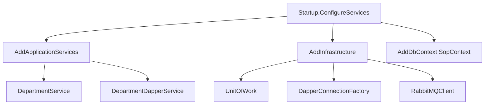
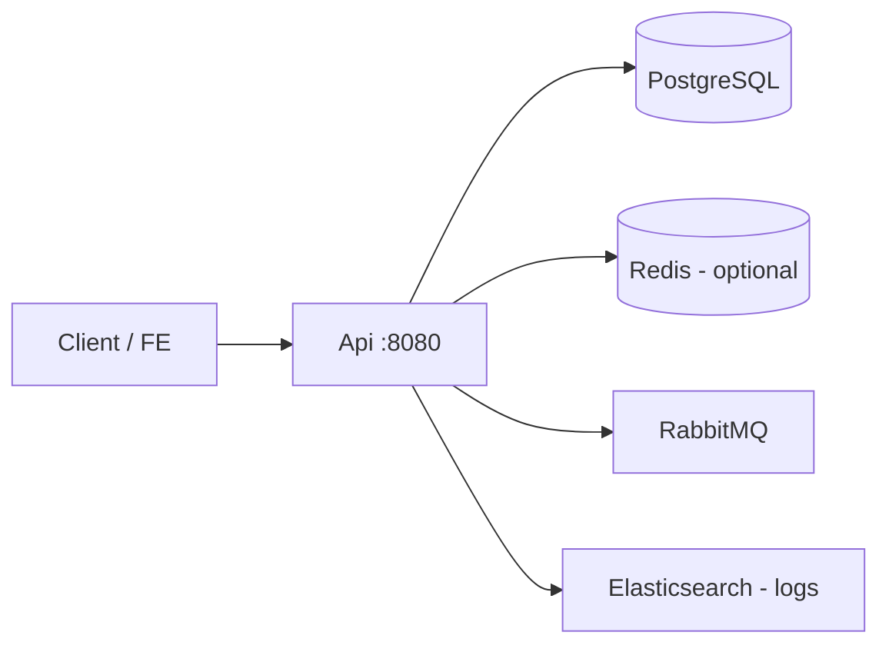

# Kiến trúc BE-EF — Hướng dẫn team

> **Phong cách:** Clean Architecture thực dụng + DB-first  
> **Mục tiêu:** Phát triển nhanh, dễ debug, vẫn tách lớp rõ ràng  
> **Stack:** .NET 10, EF Core + PostgreSQL, Dapper (tùy chọn), RabbitMQ

---

## 1. Tổng quan 4 lớp



### Quy tắc phụ thuộc (bắt buộc)

| Từ → Đến | Được? | Ghi chú |
|----------|-------|---------|
| Api → Application | ✅ | Controller chỉ inject `IServices` |
| Api → Infrastructure | ✅ | Chỉ để gọi `AddInfrastructure()` trong Startup |
| Application → Domain | ✅ | Service dùng Aggregate + Entity |
| Application → Infrastructure | ❌ | **Không** reference trực tiếp |
| Infrastructure → Application | ✅ | Implement abstraction |
| Infrastructure → Domain | ✅ | EF map Entity |
| Domain → bất kỳ | ❌ | Domain thuần, không phụ thuộc framework |

---

## 2. Luồng request (2 đường truy cập DB)

### 2.1 Đường EF + Unit of Work (mặc định)



**Khi dùng:** CRUD chuẩn, tracking entity, transaction qua `Commit()`.

### 2.2 Đường Dapper (raw SQL, hiệu năng / debug SQL)



**Khi dùng:** Query phức tạp, báo cáo, cần SQL rõ ràng, so sánh hiệu năng với EF.

---

## 3. Cấu trúc thư mục theo vai trò

```
BE-EF/
├── Api/                          # HTTP, auth, middleware
│   ├── Controllers/              # Mỏng: gọi IServices, trả ResponseApi
│   └── Extensions/               # DI Application services
│
├── Application/                  # Nơi dev làm việc chính (~80% feature mới)
│   ├── IServices/                # Contract cho Controller
│   ├── Services/                 # Logic use case (EF hoặc Dapper)
│   ├── Abstractions/
│   │   ├── Persistence/          # IUnitOfWork, IGenericRepository, IDbConnectionFactory
│   │   └── Messaging/            # IRabbitMQClient
│   ├── Request/                  # Input API
│   ├── GetMap/                   # Output / Dapper row models (DepartmentRow, DepartmentTree)
│   └── Exceptions/               # AppException → middleware
│
├── Domain/                       # Core — ít sửa tay sau scaffold
│   ├── Entities/public/          # ⚠️ CHỈ regenerate từ DB (không Behavior ở đây)
│   ├── Aggregates/               # Department, User, Position — Create/Update/SoftDelete
│   ├── ValueObjects/             # EntityCode, ...
│   └── Exceptions/               # DomainException
│
└── Infrastructure/               # Implement kỹ thuật
    ├── DataContext/              # SopContext, Mapping, Queries extensions
    ├── Repositories/           # UnitOfWork, GenericRepository
    ├── Persistence/            # DapperConnectionFactory
    ├── Messaging/              # RabbitMQClient
    └── DependencyInjection/    # AddInfrastructure()
```

---

## 4. Domain — DB-first + Aggregate



| Thành phần | Ai sửa? | Quy tắc |
|------------|---------|---------|
| `Entities/public/*` | Tool scaffold | Không thêm business method; cập nhật khi đổi schema DB |
| `Aggregates/*` | Dev | `Create`, `Update`, `SoftDelete`, validate → `DomainException` |
| `ValueObjects` | Dev | Kiểu bất biến, validate trong constructor/factory |

**Ví dụ luồng tạo phòng ban (EF):**

1. `DepartmentService` nhận `DepartmentRequest`
2. Check trùng qua `Repository<Departments>()`
3. `DepartmentAggregate.Create(EntityCode, name, ...)`
4. `Repository.Add(aggregate.Root)` → `Commit()`

---

## 5. Persistence — một abstraction, hai implementation



| Abstraction | Implementation | Dùng ở |
|-------------|----------------|--------|
| `IUnitOfWork` | `UnitOfWork` | `DepartmentService`, `UserService`, ... |
| `IGenericRepository<T>` | `GenericRepository<T>` | Qua `_unitOfWork.Repository<T>()` |
| `IDbConnectionFactory` | `DapperConnectionFactory` | `DepartmentDapperService` |
| `DbConnectionHelper` | static helper | Mọi service Dapper — mở/đóng chuẩn |

**Không tạo** `IDepartmentRepository`, `IUserRepository` riêng — tránh explosion interface.

---

## 6. API layer — Controller mỏng



**Chuẩn một action:**

```csharp
[HttpPost("create")]
public async Task<IActionResult> CreateDepartment(DepartmentRequest request)
{
    var response = await _departmentService.CreateDepartment(request);
    return Ok(new ResponseApi(response, true));
}
```

| Việc | Ở đâu | Không làm ở Controller |
|------|--------|-------------------------|
| Validate HTTP / model | Controller / DataAnnotations | SQL, EF, business rules |
| Gọi use case | `IServices` | `DbContext`, Dapper trực tiếp |
| Format response | `ResponseApi`, `GetMap` | Map thủ công từ `DataReader` |

**Hai controller Department (cùng nghiệp vụ, khác persistence):**

| Route | Service | Persistence |
|-------|---------|-------------|
| `api/department-service/department` | `IDepartmentService` | EF + UoW |
| `api/department-service/department-dapper` | `IDepartmentDapperService` | Dapper |

---

## 7. Đăng ký DI (Composition Root)

Chỉ **Api/Startup** (hoặc `Program`) được “nối dây” implementation:



| Extension | File | Đăng ký |
|-----------|------|---------|
| `AddApplicationServices()` | `Api/Extensions/ServiceExtensions.cs` | `IDepartmentService`, `IDepartmentDapperService`, ... |
| `AddInfrastructure()` | `Infrastructure/.../InfrastructureServiceExtensions.cs` | `IUnitOfWork`, `IDbConnectionFactory`, `IRabbitMQClient`, `IDataConfig` |

---

## 8. Quy trình làm feature mới (checklist team)

### A. CRUD đơn giản (khuyến nghị EF)

1. **DB:** Tạo/alter bảng → scaffold `Domain/Entities/public`
2. **Domain:** Thêm `XxxAggregate` (nếu có rule nghiệp vụ)
3. **Application:**
   - `Request/XxxRequest.cs`
   - `GetMap/XxxDto.cs` (nếu response khác entity)
   - `IServices/IXxxService.cs` + `Services/XxxService.cs` dùng `_unitOfWork.Repository<T>()`
4. **Api:** `XxxController` inject `IXxxService`
5. **DI:** Đăng ký trong `ServiceExtensions` (Application) — Infrastructure chỉ khi cần abstraction mới

### B. Query phức tạp / báo cáo (Dapper)

1. **Application:**
   - `GetMap/XxxRow.cs` — model map cột SQL (tập trung, không nested trong Service)
   - `Services/XxxDapperService.cs` — pattern:

```csharp
public async Task<List<XxxDto>> GetDataAsync(...)
{
    var connection = _connectionFactory.CreateConnection();
    try
    {
        await DbConnectionHelper.OpenConnectionAsync(connection);
        // Dapper: parameterized SQL only
        return ...
    }
    finally
    {
        DbConnectionHelper.CloseConnection(connection);
    }
}
```

2. **Api:** Controller gọi `IXxxDapperService`
3. **Không** đặt SQL trong Controller

### C. Exception

| Loại | Ném từ | Middleware map |
|------|--------|----------------|
| `DomainException` | Aggregate / Domain rule | → `AppException` hoặc 400 tại Service |
| `AppException` | Application Service | `ErrorHandlerMiddleware` |

---

## 9. So sánh EF vs Dapper trong project

| Tiêu chí | EF (`DepartmentService`) | Dapper (`DepartmentDapperService`) |
|----------|--------------------------|-------------------------------------|
| Transaction | `IUnitOfWork.Commit()` | Tự quản lý / `BEGIN` nếu cần |
| Tracking | Có | Không |
| SQL | Ẩn (LINQ / RawSqlQuery) | Rõ, dễ copy debug |
| Domain Aggregate | ✅ Dùng | ❌ Thường map thẳng SQL (pragmatic) |
| Connection | EF pool | `DbConnectionHelper` + factory |

**Chọn EF** khi: CRUD, soft delete, cần aggregate validation.  
**Chọn Dapper** khi: CTE/recursive, report, tối ưu query, team cần nhìn SQL.

---

## 10. Những điều KHÔNG làm

- ❌ Application reference Infrastructure  
- ❌ SQL / `DbContext` trong Controller  
- ❌ Business rule trong `Entities/public` (scaffold)  
- ❌ Tạo repository interface riêng cho từng bảng (trừ khi query quá đặc thù và không fit `GenericRepository`)  
- ❌ `DepartmentRow` / DTO map nằm lẻ trong Service — đặt tại `Application/GetMap`  
- ❌ Connection string hoặc `new NpgsqlConnection()` trong Application (luôn qua `IDbConnectionFactory`)

---

## 11. Sơ đồ triển khai



---

## 12. Tài liệu liên quan trong repo

| File | Nội dung |
|------|----------|
| `Application/Abstractions/Persistence/DbConnectionHelper.cs` | Mở/đóng connection Dapper |
| `Application/GetMap/DepartmentRow.cs` | Dapper row → `DepartmentTree` |
| `Domain/Aggregates/Department/DepartmentAggregate.cs` | Mẫu aggregate |
| `Infrastructure/Repositories/UnitOfWork.cs` | EF transaction |
| `Api/Extensions/ServiceExtensions.cs` | Đăng ký Application services |

---

*Cập nhật: 2026-05 — .NET 10, kiến trúc pragmatic Clean Architecture.*
